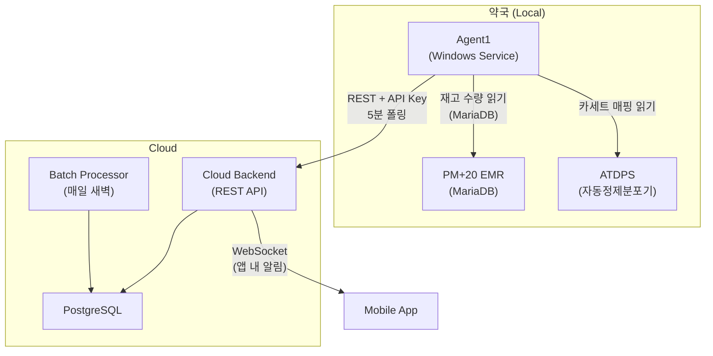
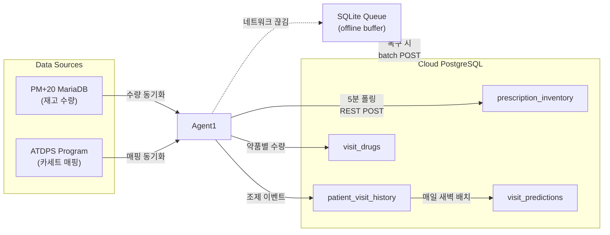
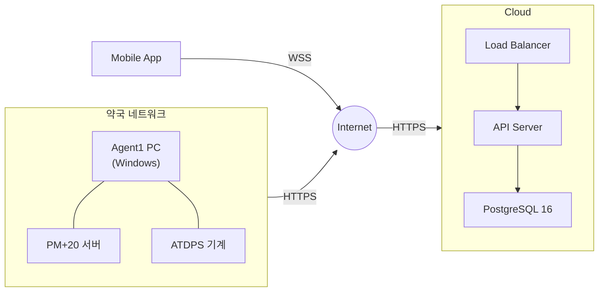
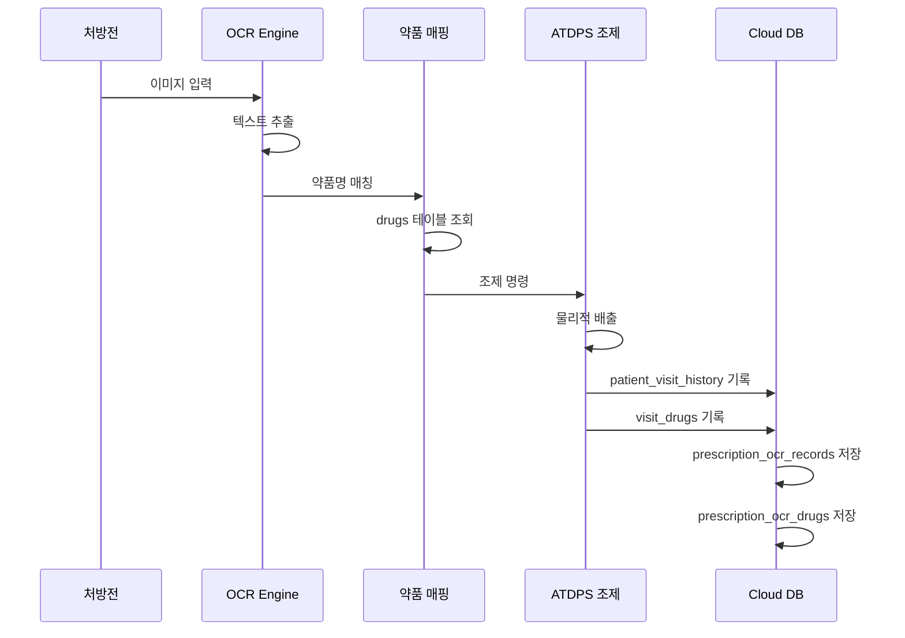
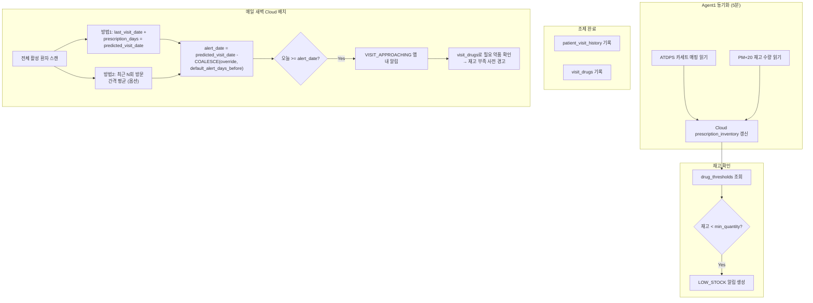

# Pharmacy Inventory & Prescription Automation - Architecture

## 1. Component Interaction

## 2. Data Flow

## 3. Network Topology

## 4. OCR + RPA Sequence

## 5. ATDPS Cassette & Visit Alert Flow

## Design Decisions (Phase 1)

| 항목 | 결정 |
|------|------|
| Agent1 ↔ Cloud 인증 | API key (`pharmacies.api_key_hash`) |
| 폴링 주기 | 5분 (configurable) |
| 동기화 방향 | ATDPS(매핑) + PM+20(수량) → Cloud 단방향 |
| visit_predictions 생성 | Cloud 매일 새벽 배치 |
| 알림 채널 | 앱 내 알림만 (`IN_APP`) |
| 재고 source of truth | PM+20 로컬 MariaDB |
| 카세트 매핑 출처 | ATDPS 프로그램 |

## Undecided / Phase 2

- deployment strategy, monitoring, error handling 세부
- RPA 구현 상세, scheduling (cron vs OS scheduler)
- prescription_days 최대값 한계 대안: per-drug 예측 → 약별로 visit_date + 해당약 처방일수로 재고 예측 (현재는 max 기반)
- optimistic locking 충돌 재시도: 3회, 100ms backoff, 초과 시 에러
